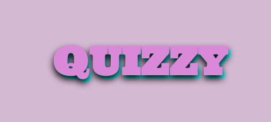
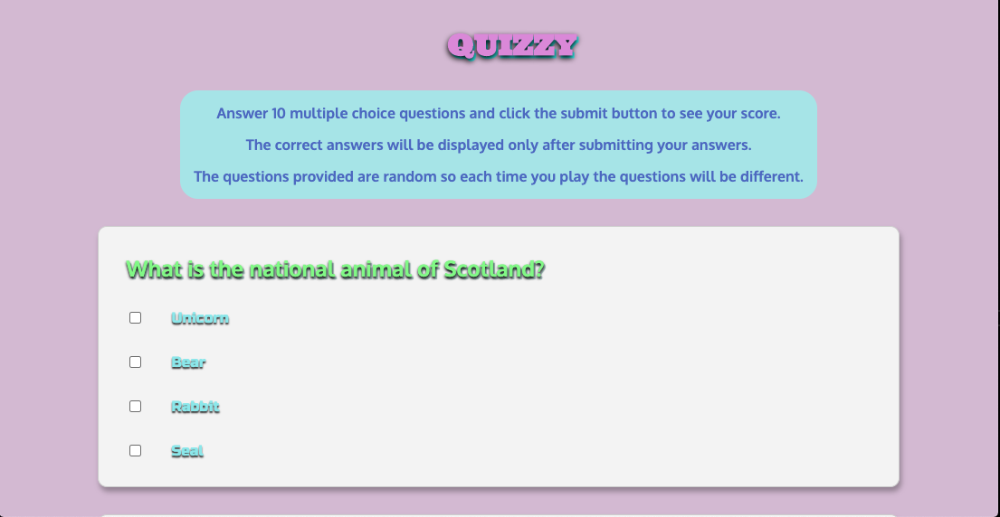
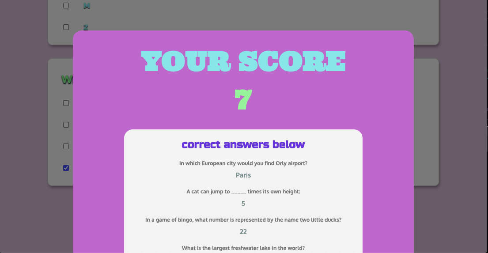

<br />
<p align="center">
  <a href="https://github.com/caseyriley/Quizzy">
    
  </a>


  <p align="center">
    A fun way to learn!
</p>


## Table of Contents

* [Installation](#installation)
* [About Quizzy](#usage)
* [Contact](#contact)


### Built With

* ReactJS


### Installation

1. Clone the repo
```sh
     git clone https://github.com/caseyriley/Quizzy.git
```
2. Install NPM packages
```sh
     npm install
```

3. Start the application
```sh
     npm start
```

## Usage

Quizzy is a simple trivia game and the instructions are clearly written at the top of the landing page.




Learning is the name of the game so make sure to checkout the correct answers after you submit your answers.



## Contact

Casey Riley - [linkedin](https://www.linkedin.com/in/casey-riley-3396231a1/) - innerforest7@gmail.com

Project Link: [https://github.com/caseyriley/Quizzy](https://github.com/caseyriley/Quizzy)

